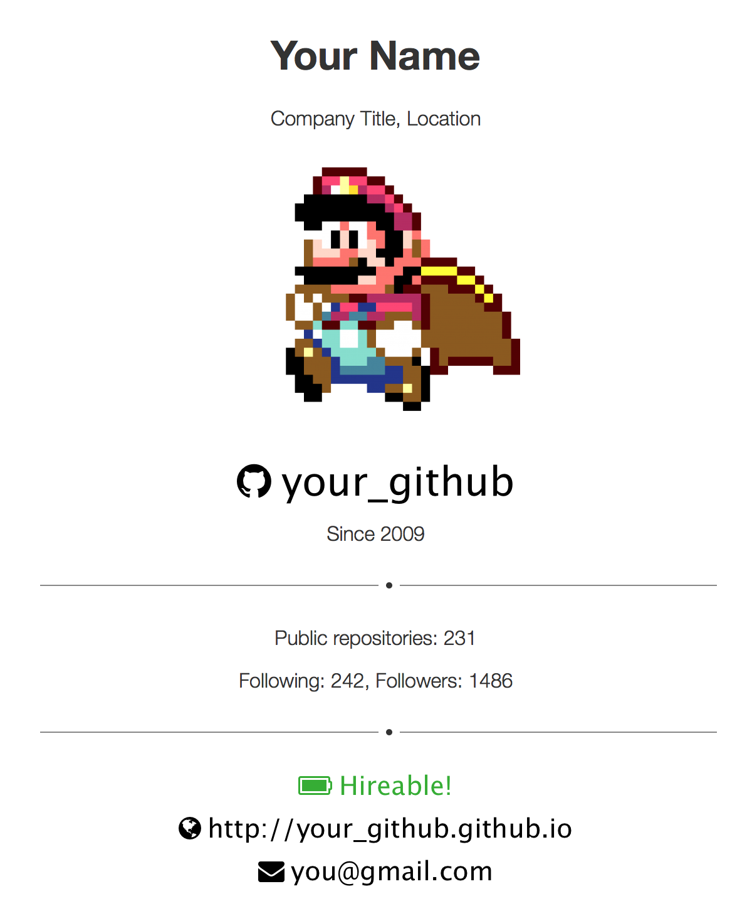

# Github user page
## Demo

[http://ssokurenko.github.io/about/](http://ssokurenko.github.io/about/)

## Usage Instructions
To create your /about page follow these steps:

### Fork the repository
Visit [https://github.com/ssokurenko/about](https://github.com/ssokurenko/about) and click:


### Open /js/config.js file and update the githubID value:

```
var config = {
    githubID: "your_github"
};
```

### Commit the update and push to origin

Your card will be available at:

```
http://your_github.github.io/about/
```


